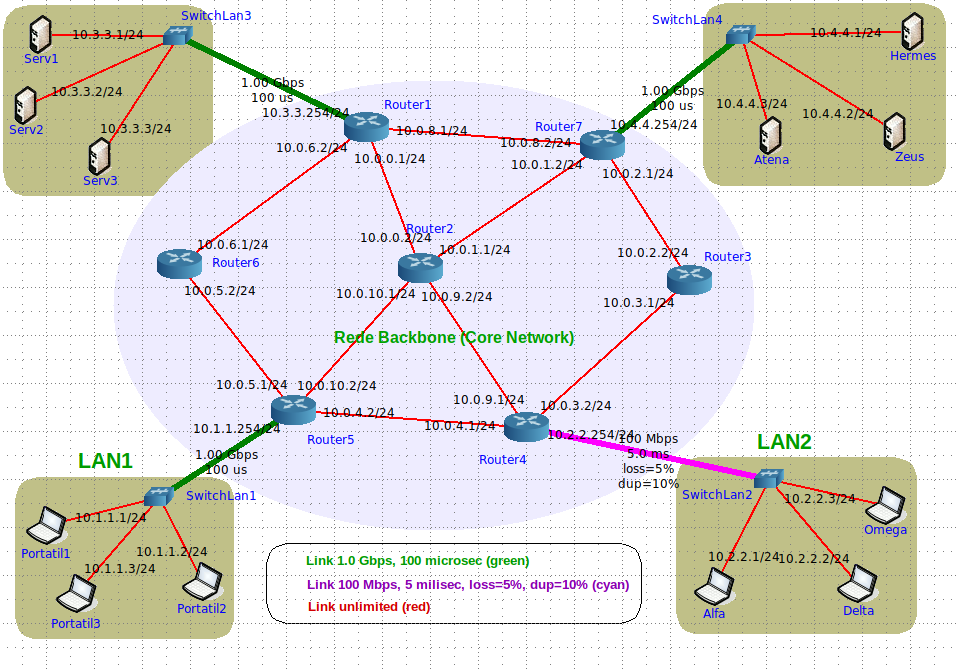

[hugo]: https://github.com/HugoCarvalho99
[hugo-pic]: https://github.com/HugoCarvalho99.png?size=120
[nelson]: https://github.com/nelsonmestevao
[nelson-pic]: https://github.com/nelsonmestevao.png?size=120
[pedro]: https://github.com/pedroribeiro22
[pedro-pic]: https://github.com/pedroribeiro22.png?size=120

# Anonymous Gateway

> Originator Anonymization Overlay Network

## :rocket: Getting Started

These instructions will get you a copy of the project up and running on your
local machine for development and testing purposes.

Start by filling out the environment variables defined in the `.env` file. Use
the `.env.sample` as a starting point.

```bash
cp .env.sample .env
```

After this, you must fill in the fields correctly and export them in your
environment. Checkout [direnv](https://direnv.net/) for your shell and
[EnvFile](https://github.com/Ashald/EnvFile) for IntelliJ.

### :inbox_tray: Prerequisites

The following software is required to be installed on your system:

- [Java SDK 11](https://openjdk.java.net/)
- [Maven](https://maven.apache.org/maven-features.html)

### :hammer: Development

Start a server instance. The `<port>` argument is optional and by default the
server will start at `:8080`.

```
bin/server [<host> <port>]
```

You can use `netcat` as the target server.

```
netcat -v -l -p <port>
```

For testing purposes, you can connect to it through also with `netcat`.

```
netcat 127.0.0.1 <port>
```

Running tests.

```
mvn test
```

Format the code accordingly to common guide lines.

```
bin/format
```

Lint your code with _checkstyle_.

```
bin/lint
```

### :microscope: Testing

The testing should happen the following [topology](resources/topology.imn). You
need to setup a target server and as many AnonGW as you wish.

{ with=300px }

The target server is prepared to run in anywhere. However, by default the AnonGW
expect it to be on `Serv1`. You can change this default behavior by providing
the IP address as the first argument to `bin/server`.

### :package: Deployment

Bundling the app into jar file.

```
mvn package
```

### :hammer_and_wrench: Tools

The recommended Integrated Development Environment (IDE) is [IntelliJ
IDEA](https://www.jetbrains.com/idea/).

For emulating a network use the Common Open Research Emulator (CORE). Setup
instructions for setting it up on a Virtual Machine with Ubuntu 20.04 are
available on our wiki [here](https://gitlab.com/mieiuminho/CC/anongw/-/wikis/Setup-CORE).

## :busts_in_silhouette: Team

| [![Hugo][hugo-pic]][hugo] | [![Nelson][nelson-pic]][nelson] | [![Pedro][pedro-pic]][pedro] |
| :-----------------------: | :-----------------------------: | :--------------------------: |
|   [Hugo Carvalho][hugo]   |    [Nelson Estevão][nelson]     |    [Pedro Ribeiro][pedro]    |

